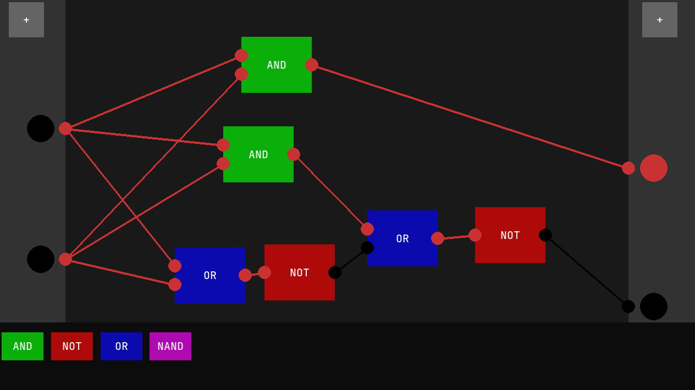

# PyHDLang: Simple Logic Gate Visualiser by Pygame



Inspired by Sebastian Lague, just programmed in Pygame instead of Unity.

Currently lacking:
- Saving logic functions
- Loading logic functions
- Ugly

# Requirements
Python 3.12.12 and a Virtual Environment were used in the making of this program.

The Pygame fonts package may encounter errors on newer versions of Python (like 14), so using Python 12 or Python 13 should be okay.

# Set-up

Installing virtualenv package:
```
pip install virtualenv
```

Setting up virtual environment:


```
python -m venv .venv
source .env/bin/activate
pip install -r requirements.txt
```

Once done, exit the virtual environment using *deactivate*

# Current Bugs
- Input plug to Input plug (or Output plug to Output plug) breaks wiring system
- Activating an Output plug, then deleting the node connected to the Output plug will not deactivate the Output plug
- There is no detection system for multiple nodes plugging into a single Output plug (Conflicts)
- Can't delete wires; Have to delete the nodes connected to it instead